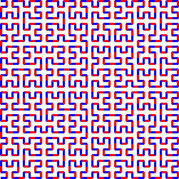
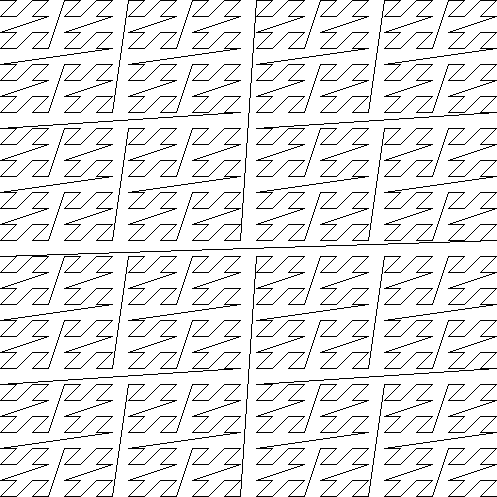

## Introduction

In words of *xorpd*, the author of `xchg rax,rax`:

> `xchg rax,rax` is a collection of assembly gems and riddles I found over many years of reversing and writing assembly code. The book contains 0x40 short assembly snippets, each built to teach you one concept about assembly, math or life in general.
>
> Be warned - This book is not for beginners. It doesn't contain anything besides assembly code, and therefore some x86_64 assembly knowledge is required.
>
> How to use this book? Get an assembler (Yasm or Nasm is recommended), and obtain the x86_64 instruction set. Then for every snippet, try to understand what it does. Try to run it with different inputs if you don't understand it in the beginning. Look up for instructions you don't fully know in the Instruction sets PDF. Start from the beginning. The order has meaning.
>
> As a final note, the full contents of the book could be viewed for free on my website (Just google "xchg rax,rax").

The original release, which can be read online at [1], contains no official solutions, and some of the snippets doesn't even seem to yield a clearly defined "answer". Also, in his own words:

> > Is that the content of your book? Some assembly language instructions without comments?
>
> Yes.
>
> > Is that a bad joke?
>
> No, arranging almost meaningless sequences of assembler instructions against a black background is a form of **art**. You may call it *nerd poetry*.

Nevertheless, I recovered from old backups my own thoughts and solutions for some of the snippets, and uploaded them just in case it could be useful or interesting for someone.

[1] [http://www.xorpd.net/pages/xchg_rax/snip_00.html](http://www.xorpd.net/pages/xchg_rax/snip_00.html)

## Solutions

### Snippet 0x00

```asm
    xor      eax,eax
    lea      rbx,[0]
    loop     $
    mov      rdx,0
    and      esi,0
    sub      edi,edi
    push     0
    pop      rbp
```

Different ways of setting several general purpose registers to *0*.


### Snippet 0x01

```asm
.loop:
    xadd     rax,rdx
    loop     .loop
```

Computes the `rcx`-th term of the Fibonacci sequence, assuming the initial state `rax=0`, `rdx=1`.


### Snippet 0x02

```asm
    neg      rax
    sbb      rax,rax
    neg      rax
```
Boolean cast: `rax := bool(rax)`, i.e. `rax := rax ? 1 : 0`.


### Snippet 0x03

```asm
    sub      rdx,rax
    sbb      rcx,rcx
    and      rcx,rdx
    add      rax,rcx
```

Minimum function: `rax := min(rax, rdx)`.


### Snippet 0x04

```asm
    xor      al,0x20
```

Replaces uppercase with lowercase characters and vice-versa.


### Snippet 0x05

```asm
    sub      rax,5
    cmp      rax,4
```

Allows to branch depending on whether `rax` is in range *[5,9]* using only one `jbe` jump.


### Snippet 0x06

```asm
    not      rax
    inc      rax
    neg      rax
```

Does nothing since the instructions cancel each other.


### Snippet 0x07

```asm
    inc      rax
    neg      rax
    inc      rax
    neg      rax
```

Does nothing since the instructions cancel each other.


### Snippet 0x08

```asm
    add      rax,rdx
    rcr      rax,1
```

Computes the average, i.e. `rax := (rax + rdx) / 2`.

Note that it prevents overflow issues since `rcr` does a 33-bit rotation using the `CF` flag.


### Snippet 0x09

```asm
    shr      rax,3
    adc      rax,0
```

Computes `rax := (rax + 4) / 8`.

This calculates `rax / 8` rounded to the nearest integer (thanks [@ZaneH](https://github.com/ZaneH)).


### Snippet 0x0A

```asm
    add      byte [rdi],1
.loop:
    inc      rdi
    adc      byte [rdi],0
    loop     .loop
```

Increments by one an **arbitrarily long** little-endian integer at `rdi`.


### Snippet 0x0B

```asm
    not      rdx
    neg      rax
    sbb      rdx,-1
```

Computes the negation of the 128-bit integer stored in the RDX:RAX registers (thanks Aviya Erenfeld!).


### Snippet 0x0C

```asm
    mov      rcx,rax
    xor      rcx,rbx
    ror      rcx,0xd

    ror      rax,0xd
    ror      rbx,0xd
    xor      rax,rbx

    cmp      rax,rcx
```

Registers `rax`, `rcx` end up with the same value, thanks to distributivity of ROR (with XOR).

```text
rcx = rax
rcx = (rcx ^ rbx) >> 13
rax = (rax >> 13) ^ (rbx >> 13)
```


### Snippet 0x0D

```asm
    mov      rdx,rbx

    xor      rbx,rcx
    and      rbx,rax

    and      rdx,rax
    and      rax,rcx
    xor      rax,rdx

    cmp      rax,rbx
```

Registers `rdx`, `rbx` end up with the same value, thanks to distributivity of AND (with XOR) and commutativity of XOR.

```text
rdx = rbx
rbx = (rbx & rax) ^ (rcx & rax)  // Associativity of AND
rax = (rdx & rax) ^ (rcx & rax)  // Commutativity of XOR
```


### Snippet 0x0E

```asm
    mov      rcx,rax
    and      rcx,rbx
    not      rcx

    not      rax
    not      rbx
    or       rax,rbx

    cmp      rax,rcx
```

Registers `rax`, `rcx` end up with the same value, thanks to DeMorgan's law.

```text
rcx = rax
rcx = ~(rcx & rbx)
rax = ~rax | ~rbx
```


### Snippet 0x0F

```asm
.loop:
    xor      byte [rsi],al
    lodsb
    loop     .loop
```

Computes the following:

```text
rsi[0] ^= al
rsi[1] ^= rsi[0]
rsi[2] ^= rsi[1]
rsi[3] ^= rsi[2]
...
```

This resembles a 8-bit CBC encryption scheme using `al` as IV, except that it uses the identity function for block cipher encryption, not a pseudorandom function with a key. Instead, the IV plays the role as key.

This was the staple home-made "crypto" in the early 80s home computer era.


### Snippet 0x10

```asm
    push     rax
    push     rcx
    pop      rax
    pop      rcx

    xor      rax,rcx
    xor      rcx,rax
    xor      rax,rcx

    add      rax,rcx
    sub      rcx,rax
    add      rax,rcx
    neg      rcx

    xchg     rax,rcx
```

Different ways of swapping the contents of `rax` and `rcx`.


### Snippet 0x11

```asm
.loop:
    mov      dl,byte [rsi]
    xor      dl,byte [rdi]
    inc      rsi
    inc      rdi
    or       al,dl
    loop     .loop
```

Compares two buffers `rsi` and `rdi` of length `rcx`. Assuming `al` is zero-initialized, it will remain as *0* unless the buffers differ.


### Snippet 0x12

```asm
    mov      rcx,rdx
    and      rdx,rax
    or       rax,rcx
    add      rax,rdx
```

Computes `(rax | rdx) + (rax & rdx)`, which can be simplified to `rax + rdx`.

See also Rich Schroeppel's *Item 23* in [HAKMEM](https://en.wikipedia.org/wiki/HAKMEM).


### Snippet 0x13

```asm
    mov      rcx,0x40
.loop:
    mov      rdx,rax
    xor      rax,rbx
    and      rbx,rdx
    shl      rbx,0x1
    loop     .loop
```

Computes `rax + rbx`.

See also: https://en.wikipedia.org/wiki/Adder_(electronics)


### Snippet 0x14

```asm
    mov      rcx,rax
    and      rcx,rdx

    xor      rax,rdx
    shr      rax,1

    add      rax,rcx
```

Computes the average rounded to the lowest integer, i.e. `rax := floor((rax + rdx) / 2)`, avoiding overflows (see also Snippet 0x08).


### Snippet 0x15

```asm
    mov      rdx,0xffffffff80000000
    add      rax,rdx
    xor      rax,rdx
```

Casts the `int32_t` value in `eax` to an `int64_t` value in `rax`.

Note that this requires the 32 most significant bits in `rax` to be cleared.


### Snippet 0x16

```asm
    xor      rax,rbx
    xor      rbx,rcx
    mov      rsi,rax
    add      rsi,rbx
    cmovc    rax,rbx
    xor      rax,rbx
    cmp      rax,rsi
```

Computes the following:

```text
rsi := (rax ^ rbx) + (rbx ^ rcx)
if (overflew(rsi))
    rax := 0
else
    rax := rax ^ rcx
cmp(rax, rsi)
```

Observations:
- If `rax` == `rbx`: No overflow.
- If `rcx` == `rbx`: No overflow.
- If `rax` == `~rbx`: Always overflows, except when `rbx` == `rcx`.
- If `rbx` == `rax|rcx`: No overflow.
- If `rbx` == `rax&rcx`: No overflow.

*TODO: No idea about this one.*


### Snippet 0x17

```asm
    cqo
    xor      rax,rdx
    sub      rax,rdx
```

Computes the absolute value of `rax`, i.e. `rax := abs(rax)`.


### Snippet 0x18

```asm
    rdtsc
    shl      rdx,0x20
    or       rax,rdx
    mov      rcx,rax

    rdtsc
    shl      rdx,0x20
    or       rax,rdx

    cmp      rcx,rax
```

Compares two consecutively obtained timestamps.

The instruction `rdtsc` stores the current 64-bit timestamp counter value in `edx:eax`, while the `shl` and `or` instructions aggregate the halves of each register into `rax`. Trivially, the second timestamp will always be larger than the first one.


### Snippet 0x19

```asm
    call     .skip
    db       'hello world!',0
.skip:
    call     print_str
    add      rsp,8
```

Calls `print_str("hello world!");`.

The return value of `.skip` is the address to the hardcoded string, and due to the stack layout, this will implicitly become the first argument of `print_str`.

This was a very common pattern in assembly language programs: The instruction sequence would be generated by a macro allowing coders to embed commands like `PRINT_STR 'Hello, world!'` in their code without having to define the string in the data segment, assign a symbol to it and then reference from code.


### Snippet 0x1A

```asm
    call     .next
.next:
    pop      rax
```

Gets the `rip` register after the call instruction, i.e. `rax := .next`. This is needed to obtain the current instruction pointer in [Position-Independent Code](https://en.wikipedia.org/wiki/Position-independent_code).


### Snippet 0x1B

```asm
    push     rax
    ret
```

Indirect branch to `rax`. Since there's no immediate arguments to cause further stack cleanup, this is equivalent to `jmp rax`.
                                                             

### Snippet 0x1C

```asm
    pop      rsp
```

Swaps the stack pointer with the address at the top of the current stack. One of the many stack pivot gadgets used during [Return-Oriented Programming](https://en.wikipedia.org/wiki/Return-oriented_programming).


### Snippet 0x1D

```asm
    mov      rsp,buff2 + n*8 + 8
    mov      rbp,buff1 + n*8
    enter    0,n+1
```

Copies `buff1` to `buff2`. The extra `+1` and `+8` take care of the side effects of `enter`, such as the extra values added before and after the buffer.

Note that the `buff2` should be 16 bytes larger than `buff1`, specifically with 8 bytes of padding at the beginning and at the end to prevent OOB writes after executing the `enter` instruction.


### Snippet 0x1E

```asm
    cmp      al,0x0a
    sbb      al,0x69
    das
```

Maps each value in range [0x0, 0xF] stored in `al` into its hexadecimal representation, i.e. [0x30, ..., 0x39, 0x41, ..., 0x46].


### Snippet 0x1F

```asm
.loop:
    bsf      rcx,rax
    shr      rax,cl
    cmp      rax,1
    je       .exit_loop
    lea      rax,[rax + 2*rax + 1]
    jmp      .loop
.exit_loop:
```

Computes the Collatz sequence for any starting number stored in `rax`.

See also: https://en.wikipedia.org/wiki/Collatz_conjecture


### Snippet 0x20

```asm
    mov      rcx,rax
    shl      rcx,2
    add      rcx,rax
    shl      rcx,3
    add      rcx,rax
    shl      rcx,1
    add      rcx,rax
    shl      rcx,1
    add      rcx,rax
    shl      rcx,3
    add      rcx,rax
```

Computes `rcx := 1337 * rax`.


### Snippet 0x21

```asm
    mov      rsi,rax
    add      rax,rbx
    mov      rdi,rdx
    sub      rdx,rcx
    add      rdi,rcx

    imul     rax,rcx
    imul     rsi,rdx
    imul     rdi,rbx

    add      rsi,rax
    mov      rbx,rsi
    sub      rax,rdi
```

Computes the following after corresponding simplifications:

```text
rax := rax * rcx - rbx * rdx
rbx := rax * rdx + rbx * rcx
```

This corresponds to the multiplication of two complex numbers:
(a + bi) * (c + di) = (ac - bd) + (ad + bc)i.

Note that it is using only three multiplications to calculate the four distinct
products in the result. This is the essence of the [Karatsuba Algorithm](https://en.wikipedia.org/wiki/Karatsuba_algorithm) for polynomial multiplication (thanks [@eleemosynator](https://twitter.com/eleemosynator)).


### Snippet 0x22

```asm
    mov      rdx,0xaaaaaaaaaaaaaaab
    mul      rdx
    shr      rdx,1
    mov      rax,rdx
```

Computes `rax := rax / 3` rounding to the closest integer.


### Snippet 0x23

```asm
.loop:
    cmp      rax,5
    jbe      .exit_loop
    mov      rdx,rax
    shr      rdx,2
    and      rax,3
    add      rax,rdx
    jmp      .loop
.exit_loop:

    cmp      rax,3
    cmc
    sbb      rdx,rdx
    and      rdx,3
    sub      rax,rdx
```

Computes `rax := rax % 3`.

Note that _2<sup>2k</sup> = 1 (mod 3)_ and _2<sup>2k+1</sup> = 2 (mod 3)_. Hence, in order to calculate `rax % 3` one can sum the digits of the number written in base four (i.e. sum pairs of bits at even locations) and take the result modulo 3.

There is also a cute bit of code at the end that does the final reduction modulo 3 without any branches. This trick is the base 4 equivalent of using the sum of the digits of a number in base 10 to check for divisibility by 3. Both tricks work in the same way because both 10 and 4 leave a remainder of 1 when divided by 3 (thanks [@eleemosynator](https://twitter.com/eleemosynator)).


### Snippet 0x24

```asm
    mov      rbx,rax
    mov      rsi,rax
.loop:
    mul      rbx
    mov      rcx,rax

    sub      rax,2
    neg      rax
    mul      rsi
    mov      rsi,rax

    cmp      rcx,1
    ja       .loop
.exit_loop:
```

This computes the multiplicative inverse of `rax` modulo 2<sup>64</sup> using the Newton-Raphson algorithm, which we can write as follows:

```c
uint64_t multiplicative_inverse_mod_2_64(uint64_t x)
{
	uint64_t z = x;
	uint64_t t = 0;
	do {
		t = x * z;
		z = z * (2 - t);
	} while (t > 1);
	return z;
}
```

This paper has a good analysis: https://arxiv.org/pdf/1209.6626.pdf.

Notice also that the loop exit condition takes advantage of the intermediate multiplication `x * z` to early out and also avoid having to maintain a separate loop counter. Also note that the loop condition is checked at the end - this trades off the cost of an extra couple of operations at the end of the algorithm against adding an extra branch in the middle of the loop which would be more expensive on modern architectures (thanks [@eleemosynator](https://twitter.com/eleemosynator)).

### Snippet 0x25

```asm
    xor      eax,eax
    mov      rcx,1
    shl      rcx,0x20
.loop:
    movzx    rbx,cx
    imul     rbx,rbx

    ror      rcx,0x10
    movzx    rdx,cx
    imul     rdx,rdx
    rol      rcx,0x10

    add      rbx,rdx
    shr      rbx,0x20
    cmp      rbx,1
    adc      rax,0
    loop     .loop
```

Register `rax` acts as a counter, and `rcx` loops from 0x100000000 to 0x0. Each iteration will split the `ecx` values in two 16-bit halves, *x* and *y*, and verify the following property:

```text
(x*x + y*y) >> 20 == 1
```

Since *x* and *y* are each 16-bit, `x*x + y*y` must be in range *[0x0, 0x1FFFC0002]*, thus `(x*x + y*y) >> 20` must be either 0 or 1. Therefore, each iteration is actually verifying that: `x*x + y*y >= 0x100000000`. This is equivalent to *x^2 + y^2 >= 0x10000^2*.

Since *(x,y)* iterate each in range *[0x0000, 0xFFFF]* as `rcx` decreases. The value stored in `rax` after the snippet has been executed will be the number of points in *[0, 65535]^2* lying outside the circumference of radius 65536 centered at the origin.

This ratio of points will be *1 - pi/4*, yielding an expected value of `rax := 0x100000000 * (1 - pi/4)`.


### Snippet 0x26

```asm
    mov      rdx,rax
    shr      rax,7
    shl      rdx,0x39
    or       rax,rdx
```

Rotates the value in the `rax` register 7 bits to the right. Equivalent to `ror rax, 7`.


### Snippet 0x27

```asm
    mov      ch,cl
    inc      ch
    shr      ch,1
    shr      cl,1
    shr      rax,cl
    xchg     ch,cl
    shr      rax,cl
```

This computes: `rax := rax >> ((cl >> 1) + ((cl + 1) >> 1))` which is equivalent to `rax := rax / 2**T(cl)`, where *T(n) := n(n+1)/2* represents the *n*-th [triangular number](https://en.wikipedia.org/wiki/Triangular_number).

The denominator in the expression above corresponds to the sequence [A006125](https://oeis.org/A006125) as `cl` increases.

*TODO: Is there anything else special about this snippet?*


### Snippet 0x28

```asm
    clc
.loop:
    rcr      byte [rsi],1
    inc      rsi
    loop     .loop
```

Left-shifts by one an entire buffer at `rsi` with a length of `rcx` bytes. This can also be interpreted as left-shifting by one, i.e. dividing by two, an **arbitrarily long** big-endian `8*rcx`-bit integer at `rsi`.


### Snippet 0x29

```asm
    lea      rdi,[rsi + 3]
    rep movsb
```

Repeats the first 3 bytes at `rsi` starting from offset `rsi+3` until `rcx` bytes have been written.

This could be used to fill a texture of 24-bit pixels with a constant color stored in the first pixel of the buffer. In this case, the first 3 bytes would be written, and then the snippet would be executed with `rcx := 3 * width * height - 3`.


### Snippet 0x2A

```asm
    mov      rsi,rbx
    mov      rdi,rbx
.loop:
    lodsq
    xchg     rax,qword [rbx]
    stosq
    loop     .loop
```

This moves the last element of the array of `rcx` keywords pointed by `rbx` to the front.

For instance, let `rcx :=  4` and `rbx` point to *[Q0, Q1, Q2, Q3, Q4]* with quadwords *Qi*. Then, after executing this snippet the contents of `rbx` will be: *[Q4, Q0, Q1, Q2, Q3]*.


### Snippet 0x2B

```asm
    xor      eax,eax
    xor      edx,edx
.loop1:
    xlatb
    xchg     rax,rdx
    xlatb
    xlatb
    xchg     rax,rdx
    cmp      al,dl
    jnz      .loop1

    xor      eax,eax
.loop2:
    xlatb
    xchg     rax,rdx
    xlatb
    xchg     rax,rdx
    cmp      al,dl
    jnz      .loop2
```

Cycle-finding using [Floyd's Algorithm](https://en.wikipedia.org/wiki/Cycle_detection#Floyd.27s_Tortoise_and_Hare).
This snippet assumes that `rbx` points to a table of values of a function that has a single byte argument and single byte value.
Consider the sequence _x<sub>n</sub>=f(x<sub>n-1</sub>)_. For any starting value this sequence will eventually start cycling as _f_
only takes 256 distinct values and has no memory. 
The first half of the snippet executes Floyd's Tortoise and Hare algorithm to find a collision point inside the cycle and the second
part locates the head of the cycle which is the result of the snippet. To see this, assume that the sequence has a starting segment
of length _l_ followed by a cycle of length _n_. If our Tortoise and Hare collide at step _s_, then their locations within the cycle must
be identical and we must have:

<p align="center"> <i>s - l = 2 s - l (</i>mod<i> n) => s = 0 (</i>mod<i> n)</i></p>

Which implies that the Tortoise's location within the cycle is equal to _-l_ modulo _n_, Hence, if we start another Tortoise from the
initial point and have both Tortoises walk at the same rate, they will collide at the head of the cycle.

<!--
 For example, for the function _f(x) = 5 + x<sup>2</sup>(_ mod _256)_ when starting from 0 we
get: _0, 5, 30, 137, 86, 233, 22, 233, 22, ..._ --> 
 In `C` this looks like:

```c
typedef unsigned char byte;

byte snippet_0x2b(byte *tbl, byte x0)	// tbl in EBX, x0 is set zero
{
   byte t, h;                         // Tortoise and Hare
   t = h = x0;
   do {
       t = tbl[t];
       h = tbl[tbl[h]];
    } while (t != h);

    for (byte t2 = x0; t2 != t;) {
       t  = tbl[t];
       t2 = tbl[t2];
    }

    return t;
}
```

(thanks [@eleemosynator](https://twitter.com/eleemosynator))


### Snippet 0x2C

```asm
    mov      qword [rbx + 8*rcx],0
    mov      qword [rbx + 8*rdx],1
    mov      rax,qword [rbx + 8*rcx]

    mov      qword [rbx],rsi
    mov      qword [rbx + 8],rdi
    mov      rax,qword [rbx + 8*rax]
```

This will move `rsi` or `rdi` into `rax` depending on whether `rcx` and `rdx` are different or not, respectively. This is equivalent to: `rax := (rcx == rdx) ? rdi : rsi`. This assumes that all `rbx`-relative offsets point to valid memory. Effectively a comparison and conditional move implemented using just `mov` instructions.

The [M/o/Vfuscator](https://github.com/xoreaxeaxeax/movfuscator) project takes this concept to a whole new extreme and delivers a C compiler the produces binaries which only contain `mov` instructions (with a tiny amount of cheating for loops).


### Snippet 0x2D

```asm
    mov      rdx,rax
    dec      rax
    and      rax,rdx
```

Determines if `rax` is a power of two by computing `rax := rax & (rax - 1)`. The result will be zero if and only if `rax` is a power of two.


### Snippet 0x2E

```asm
    mov      rdx,rax
    dec      rdx
    xor      rax,rdx
    shr      rax,1
    cmp      rax,rdx
```

Determines if `rax` is a power of two larger than zero by comparing `(rax ^ (rax - 1)) >> 1` and `rax - 1`. Both values will be equal if and only if `rax` is a power of two larger than zero. Note that the case `rax == 0` will result on different values due to the right-shift operation.

See also: Snippet 0x2D.


### Snippet 0x2F

```asm
    xor      eax,eax
.loop:
    jrcxz    .exit_loop
    inc      rax
    mov      rdx,rcx
    dec      rdx
    and      rcx,rdx
    jmp      .loop
.exit_loop:
```

This snippet stores the number of `1`-bits in `rcx` into the `rax` register. This relies on the trick features in *Snippet 0x2D* to clear the rightmost `1`-bit until `rcx` is zero.

See also: Snippet 0x2D.


### Snippet 0x30

```asm
    and      rax,rdx

    sub      rax,rdx
    and      rax,rdx

    dec      rax
    and      rax,rdx
```

This snippet computes `((((rax & rdx) - rdx) & rdx) - 1) & rdx`. This expression is equivalent to `rax & rdx`.


### Snippet 0x31

```asm
    mov      rcx,rax
    shr      rcx,1
    xor      rcx,rax

    inc      rax

    mov      rdx,rax
    shr      rdx,1
    xor      rdx,rax

    xor      rdx,rcx
```

The snippet is nicely laid out in four stanzas to give us a hint of what's going on. The first and third calculate `x^(x>>1)` which
transforms an index to the corresponding [Gray Code](https://en.wikipedia.org/wiki/Gray_code) sequence element (see also Sloane's [A003188](https://oeis.org/A003188)). Hence the whole snippet
will calculate the `xor` of two consecutive Gray Codes. These will differ in exactly one bit which corresponds to the highest power
of 2 that divides `x+1` (Sloane's [A006519](https://oeis.org/A006519)). This is also equivalent to `~x&(x+1)`.

(thanks [@eleemosynator](https://twitter.com/eleemosynator))


### Snippet 0x32

```asm
    mov      rcx,rax

    mov      rdx,rax
    shr      rdx,1
    xor      rax,rdx

    popcnt   rax,rax
    xor      rax,rcx
    and      rax,1
```

This computes `rax := (popcnt((rax >> 1) ^ rax) ^ rax) & 1` where *popcnt* computes the number of `1`-bits. This evaluates to `0` for all inital values of `rax`.


### Snippet 0x33

```asm
    mov      rdx,rax
    shr      rdx,0x1
    xor      rax,rdx

    mov      rdx,rax
    shr      rdx,0x2
    xor      rax,rdx

    mov      rdx,rax
    shr      rdx,0x4
    xor      rax,rdx

    mov      rdx,rax
    shr      rdx,0x8
    xor      rax,rdx

    mov      rdx,rax
    shr      rdx,0x10
    xor      rax,rdx

    mov      rdx,rax
    shr      rdx,0x20
    xor      rax,rdx
```

Maps a [Gray Code](https://en.wikipedia.org/wiki/Gray_code) to its corresponding sequence number. This is the inverse operation of `x^(x>>1)`. See also snippet 0x31.

```cpp
rax := (rax >> 0x01) ^ rax
rax := (rax >> 0x02) ^ rax
rax := (rax >> 0x04) ^ rax
rax := (rax >> 0x08) ^ rax
rax := (rax >> 0x10) ^ rax
rax := (rax >> 0x20) ^ rax
```

See also: https://en.wikipedia.org/wiki/Gray_code


### Snippet 0x34

```asm
    mov      ecx,eax
    and      ecx,0xffff0000
    shr      ecx,0x10
    and      eax,0x0000ffff
    shl      eax,0x10
    or       eax,ecx

    mov      ecx,eax
    and      ecx,0xff00ff00
    shr      ecx,0x8
    and      eax,0x00ff00ff
    shl      eax,0x8
    or       eax,ecx

    mov      ecx,eax
    and      ecx,0xcccccccc
    shr      ecx,0x2
    and      eax,0x33333333
    shl      eax,0x2
    or       eax,ecx

    mov      ecx,eax
    and      ecx,0xf0f0f0f0
    shr      ecx,0x4
    and      eax,0x0f0f0f0f
    shl      eax,0x4
    or       eax,ecx

    mov      ecx,eax
    and      ecx,0xaaaaaaaa
    shr      ecx,0x1
    and      eax,0x55555555
    shl      eax,0x1
    or       eax,ecx
```

The snippet is made of five blocks, each aggregating and adding pairs of consecutive ranges of adjacent bits from the `rax` register. The size of this ranges in each block are respectively: 1, 2, 4, 8 and 16 bits.


### Snippet 0x35

```asm
    mov      edx,eax
    and      eax,0x55555555
    shr      edx,0x1
    and      edx,0x55555555
    add      eax,edx

    mov      edx,eax
    and      eax,0x33333333
    shr      edx,0x2
    and      edx,0x33333333
    add      eax,edx

    mov      edx,eax
    and      eax,0x0f0f0f0f
    shr      edx,0x4
    and      edx,0x0f0f0f0f
    add      eax,edx

    mov      edx,eax
    and      eax,0x00ff00ff
    shr      edx,0x8
    and      edx,0x00ff00ff
    add      eax,edx

    mov      edx,eax
    and      eax,0x0000ffff
    shr      edx,0x10
    and      edx,0x0000ffff
    add      eax,edx
```

The snippet is made of five blocks, each aggregating and adding pairs of consecutive ranges of adjacent bits from the `rax` register. The size of this ranges in each block are respectively: 1, 2, 4, 8 and 16 bits.

See also: Snippet 0x34.


### Snippet 0x36

```asm
    dec      rax

    mov      rdx,rax
    shr      rdx,0x1
    or       rax,rdx

    mov      rdx,rax
    shr      rdx,0x2
    or       rax,rdx

    mov      rdx,rax
    shr      rdx,0x4
    or       rax,rdx

    mov      rdx,rax
    shr      rdx,0x8
    or       rax,rdx

    mov      rdx,rax
    shr      rdx,0x10
    or       rax,rdx

    mov      rdx,rax
    shr      rdx,0x20
    or       rax,rdx

    inc      rax
```

Maps positive values in `rax` to their next power of two, or itself if already a power of two. Non-positive values get mapped to 0.

This works by decreasing the number and replicating the most-significant non-zero bits to all their relatively least-significant bits, resulting in a value of the form *2^N - 1*. Finally, the number is incremented to obtain the desired power of two.


### Snippet 0x37

```asm
    mov      rdx,rax
    not      rdx
    mov      rcx,0x8080808080808080
    and      rdx,rcx
    mov      rcx,0x0101010101010101
    sub      rax,rcx
    and      rax,rdx
```

The goal seems to be replacing each byte in the `rax` register with 0x00 if non-zero, or with 0x80 if zero. For instance:

```text
0102030400000000 => 8080808000000000
0500060007000800 => 8000800080008000
0000FFFE00000102 => 0000808000008080
...
```

However, 0x01 bytes followed exclusively by 0x00 or 0x01 bytes to their right are an exception and will be replaced with 0x80 as well, since substracting both the carried bit and the 0x01 byte will turn them into a negative byte. For instance:

```text
0100000000000000 => 8080808080808080
0101000000000000 => 8080808080808080
FF01010000000000 => 0080808080808080
...
```

*TODO: It's not clear whether this is a bug, or a feature.*


### Snippet 0x38

```asm
    bsf      rcx,rax

    mov      rdx,rax
    dec      rdx
    or       rdx,rax

    mov      rax,rdx
    inc      rax

    mov      rbx,rdx
    not      rbx
    inc      rdx
    and      rdx,rbx
    dec      rdx

    shr      rdx,cl
    shr      rdx,1

    or       rax,rdx
```

*TODO: No idea about this one.*


### Snippet 0x39

```asm
    mov      rdx,0xaaaaaaaaaaaaaaaa
    add      rax,rdx
    xor      rax,rdx
```

Computes the negabinary representation of `rax`.

Instead of having the binary basis *(+1, +2, +4, +8, +16, +32, ...)*, negabinary numbers have the basis *(+1, -2, +4, -8, +16, -32, ...)*. For instance, the number *3* (i.e. 0b11) gets mapped into 0b111 (i.e. 7) since *3 = 4 - 2 + 1*.


### Snippet 0x3A

```asm
    mov      rdx,rax
    neg      rdx
    and      rax,rdx

    mov      rdx,0x218a392cd3d5dbf
    mul      rdx
    shr      rax,0x3a

    xlatb
```

This snippet computes the amount of (left-most) leading zeros via De Bruijn sequences.

The first block determines the highest power of two dividing `rax` by computing `rax := rax & (-rax)`. This results in the sequence [A006519](https://oeis.org/A006519) whose first elements are: 0, 1, 2, 1, 4, 1, 2, 1, 8, ...

The second block together with the `xlatb` instruction computes `rax := rbx[(rax * 218A392CD3D5DBF) >> 58]` where `rbx` points to a De Bruijn table with 64 entries. This is equivalent to computing the binary logarithm of the previous 64-bit integer.

See also: http://supertech.csail.mit.edu/papers/debruijn.pdf


### Snippet 0x3B

```asm
    cdq
    shl      eax,1
    and      edx,0xc0000401
    xor      eax,edx
```

This snippet computes:

```cpp
if (eax >= 0)
    eax = (eax * 2)
else
    eax = (eax * 2) ^ 0xC0000401
```

*TODO: Is there anything else special about this snippet?*


### Snippet 0x3C

```asm
    mov      rbx,rax
    mov      rdx,rbx
    mov      rcx,0xaaaaaaaaaaaaaaaa
    and      rbx,rcx
    shr      rbx,1
    and      rbx,rdx
    popcnt   rbx,rbx
    and      rbx,1

    neg      rax
    mov      rdx,rax
    mov      rcx,0xaaaaaaaaaaaaaaaa
    and      rax,rcx
    shr      rax,1
    and      rax,rdx
    popcnt   rax,rax
    and      rax,1

    mov      rdx,rax
    add      rax,rbx
    dec      rax
    neg      rax
    sub      rdx,rbx
```

This snippet expects a number in `rax` and returns two outputs which are -1, 1 or 0 in `rax` and `rdx`. If we interpret the input as a sequence number and the outputs as steps in two dimensions (i.e. *dx* and *dy*) we can draw the result: 

<p align="center">
    
</p>

This truly mind-blowing snippet draws a [Hilbert Curve](https://en.wikipedia.org/wiki/Hilbert_curve) in 21 assembly instructions without using recursion or branches. You can experiment with the Python implementation of the algorithm in [xorpd_0x3c_hilbert.py](./xorpd_0x3c_hilbert.py) (requires [Pillow](https://pillow.readthedocs.io/en/stable/)).

<!-- TODO: Write an explanation of why this works -->

(thanks [@eleemosynator](https://twitter.com/eleemosynator))


### Snippet 0x3D

```asm
    mov      rcx,1
.loop:
    xor      rax,rcx
    not      rax
    and      rcx,rax
    not      rax

    xor      rdx,rcx
    not      rdx
    and      rcx,rdx
    not      rdx

    shl      rcx,1
    jnz      .loop
```

The registers `rax` and `rdx` serve both as inputs and outputs of this snippet. Starting it at (0, 0) and treating the results as points in the 2D plane, we get the following pattern:

<p align="center">
    
</p>

This is the [Morton Curve](https://en.wikipedia.org/wiki/Z-order_curve) or *Z-order curve*. It's based around the idea of visiting all points on the 2D plane in a hierarchical nearest-neighbour Z-pattern. To understand the generation algorithm consider the following method for incrementing an integer with *N* bits:

* For *k* in [0, *N*-1]:
  * Flip bit *k* of the integer
  * If the bit transitioned from 0 to 1 then STOP
  
The loop in the algorithm above tracks the propagation of the carry with the loop exiting when it finds a 0 bit that can finally absorb the carry by turning into a 1. Expressed in the same language, the algorithm in the snippet does the following (naming the inputs *x* and *y*):

* For *k* in [0, *N*-1]:
  * Flip bit *k* of *x*
  * If the bit transitioned from 0 to 1 then STOP
  * Flip bit *k* of *y*
  * If the bit transitioned from 0 to 1 then STOP

We have exactly the same carry-propagation structure except that the carry propagates from bit *k* of *x* to bit *k* of *y* before moving up to bit *k+1* of *x*. This operation is exactly equivalent to incrementing an integer that is constructed by interleaving the bits of *x* and *y*, with the bits of *x* taking the even positions and the bits of *y* on the odd positions.

Both the snippet version and the interleaved increment version of the algorithm are implemented in the Python script [xorpd_0x3d_morton.py](./xorpd_0x3d_morton.py) (requires [Pillow](https://pillow.readthedocs.io/en/stable/)).

(thanks [@eleemosynator](https://twitter.com/eleemosynator))


### Snippet 0x3E

```asm
    mov      rdx,rax
    shr      rdx,1
    xor      rax,rdx

    popcnt   rax,rax
    and      rax,0x3
```

Computes the direction of the lines in the (Heighway) Dragon Curve by computing `popcnt(rax ^ (rax >> 1)) & 3`. This produces the sequence [A246960](https://oeis.org/A246960), the fixed point of the morphism *{0 -> (0,1), 1 -> (2,1), 2 -> (2,3), 3 -> (0,3)}*.


### Snippet 0x3F

```asm
    mov      rbx,3
    mov      r8,rax
    mov      rcx,rax
    dec      rcx

    and      rax,rcx
    xor      edx,edx
    div      rbx
    mov      rsi,rdx

    mov      rax,r8
    or       rax,rcx
    xor      edx,edx
    div      rbx
    inc      rdx
    cmp      rdx,rbx
    sbb      rdi,rdi
    and      rdi,rdx

    bsf      rax,r8
```

This snippet takes a counter as input in `rax` and return two numbers between 0 and 2 in `rsi` and `rdi` and a number between 0 and 63
in `rax`. The use of `rsi` and `rdi` is probably a hint as they are the source index and destination index registers indicating that
something is to be moved from one position to another. If we draw the outputs for successive values of `rax` we get:

<p align="center">
    
</p>

This sequence is the solution to the [Towers of Hanoi](https://en.wikipedia.org/wiki/Tower_of_Hanoi), and the snippet above implements its [binary solution](https://en.wikipedia.org/wiki/Tower_of_Hanoi#Binary_solution).

According to the legend, there is a hidden monastery in Hanoi which contains a large room with three time-worn posts and 64 golden disks. The monks, all sworn to secrecy, have been following rules of the *Towers of Hanoi* and moving the disks one at a time from peg to peg. It is said that when they have completed the sequence and all 64 golden disks are the middle peg then the universe will finally come to an end.

How appropriate then that the 64th and last snippet in the book solves a 64-disk Hanoi puzzle which once completed will signal the end of the universe. However there is one strange quirk - the third stanza that calculates the destination peg does something like `(((m | m - 1) + 1) % 3 + 1) % 3` where the second reduction modulo 3 is done using the `cmp/sbb/and` pattern. Why not just increment `m | m - 1` before the first reduction? It turns out that doing so would give the wrong destination for several of the end-game moves as `m | m - 1` would become 2<sup>64</sup>-1 and hence increment to zero instead of the intended 1.

The monks of Hanoi need not worry, if they follow the instructions of this snippet the universe will come to an orderly end as originally intended.

(thanks [@eleemosynator](https://twitter.com/eleemosynator))
