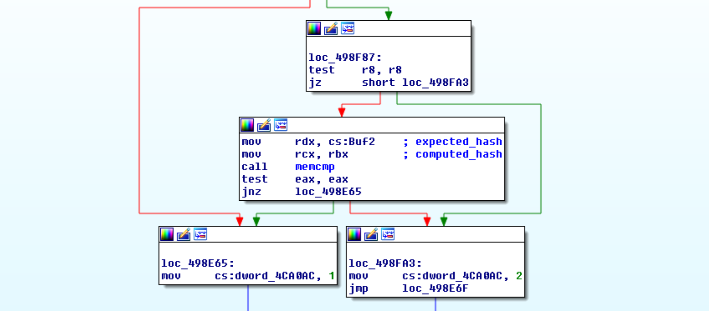

Last weekend I participated on the [Google CTF 2017](https://capturetheflag.withgoogle.com/) as part of the glorious team "*63 7c 77 7b f2 6b 6f c5 30 01 67 2b fe d7 ab 76*" composed of [AlexF0rtune](https://twitter.com/AlexF0rtune) and me. Among the many tough and fun challenges that we attempted, and the few ones that we actually solved, *moon* was certainly the most entertaining one for me, so I decided to prepare a writeup of my solution.

The problem simply states:

> What's the password?
> [moon.zip](moon.zip)


## Static analysis

After extracting the ZIP file, we see our target is a Win32 executable, using OpenGL to render a simple UI asking for a password of length 32. For wrong passwords it will display the message: "*Nope*".

As usual with these kind of challenges, one would start by looking for occurrences of this string within the executable, and find code referencing said string. Opening the executable with [IDA Pro](https://www.hex-rays.com/products/ida/) and searching for strings containing `Nope` we find the string `____NopeGood` referenced in `sub_402660`. Decompiled and slightly formatting the relevant code results in:

```cpp
// const char aNopegood[] = "    NopeGood";
v12 = dword_4CA0AC;
v15 = 4 * v12;
v16 = (unsigned __int8)aNopegood[v15];
```

The value `dword_4CA0AC` acts as an index into the aforementioned string. If we want to succeed (i.e. obtain `Good`) we need its value to be 2. If we search of occurrences where the value at `4CA0AC` is modified to 2 we obtain the following occurrence in the function `sub_498A10`:



In order to pass the test, both buffers passed to `memcmp` have to match.


## Dynamic analysis

To simplify the process of reversing, we used [x64dbg](http://x64dbg.com/) to quickly debug and inspect the memory of the program while it's running.

These buffers seem to contain each 512 bytes of what looks like the hexadecimal representation of a hash. The contents pointed by `rcx` change every time the password is modified (*computed hash string*). The contents pointed by `rdx` are constant (*expected hash string*) and it's first bytes are:

```
                   0  1  2  3  4  5  6  7  8  9  A  B  C  D  E  F  0123456789ABCDEF
0000000000F86BD0  33 30 63 37 65 61 64 39 37 31 30 37 37 37 35 39  30c7ead971077759         
0000000000F86BE0  36 39 62 65 34 62 61 30 30 63 66 35 35 37 38 66  69be4ba00cf5578f         
...
```

After reversing `sub_498A10`, we realize that the *computed buffer* is generated by converting each integer from a buffer `uint32_t hash[64]` (i.e. length 0x100) into a hexadecimal string via `%.8x` (see `sub_4016D0`). Concatenating all these hexadecimal strings results in the aforementioned hexadecimal string. Relevant code:

```cpp
v14 = (__int128 *)&v41;
// ...
if ((unsigned __int8)sub_401BF0(qword_4CA080, (unsigned __int64)&v41)) {
  do {
    v15 = *(_DWORD *)v14;
    v28 = 0i64;
    v29 = 0;
    sub_4016D0(&v28, "%.8x", v15);
    v16 = (char *)&v28 + strlen((const char *)&v28);
    if ( v16 - (char *)&v28 > 0x7FFFFFFFFFFFFFFFi64 - Size )
      sub_4921C0("basic_string::append");
    sub_486EE0(&Memory, &v28, v16 - (char *)&v28);
    v14 = (__int128 *)((char *)v14 + 4);
  }
  // ...
}
```

This buffer pointed by `v41` contains the raw bytes of the hash. This hash is updated by the function `sub_401BF0(const char* password, char* hash)` every time the user-supplied password reaches 32 characters in length.

Brief pause:
> As you see, instead of reverse engineering entire functions and then making sense of the code, our approach could be described as doing inverse data-taining manually and reverse engineering only the necessary bits along the way.

Inside `sub_401BF0` we attempted to locate where the data copied to the hash pointer `v41` was coming from. It was being copied from another buffer at address `0000000007478000` (in that particular execution) which looked "quite suspicious" due to following reasons:

1. Hardware breakpoints on memory accesses were not working.
2. This buffer was filled right after calling functions from my GPU driver libraries (in my case `ig9icd64.dll`), most likely just its OpenGL implementation.

```
                   0  1  2  3  4  5  6  7  8  9  A  B  C  D  E  F  0123456789ABCDEF
0000000007478000  01 00 00 00 01 00 00 00 01 00 00 00 01 00 00 00  ................         
0000000007478010  01 00 00 00 01 00 00 00 01 00 00 00 01 00 00 00  ................         
...        
0000000007478100  E3 5C A9 DE C6 42 8F 29 61 7C A1 5C 44 62 87 AB  ã\©ÞÆB.)a|¡\Db.«         
0000000007478110  E7 1D B9 DA C2 03 9F 2D 65 3D B1 58 40 23 97 AF  ç.¹ÚÂ..-e=±X@#.¯         
...
```

We suspect GPGPU is coming into play and that compute shaders might be responsible for generating the hash.


## Extracting compute shaders

Looking at the strings in the executable, it's clear that no compute shader is visible as plaintext. However, rather than inspecting which of the many functions is responsible of decrypting the GLSL source, or trying to locate it somewhere within the user address space. We fetch it from where the application could never hide it: the GPU driver libraries.

For that purpose we use [Apitrace](http://apitrace.github.io/). We spawn *moon.exe* with it, in *OpenGL* mode, fill out a dummy password, close the application and proceed to inspect the list of captured frames. From the long list of frames, most with 1027 calls, we notice one with 1041 calls. As expected, the small difference here is that the application maps shader storage buffer and fills it with `GL_COMPUTE_SHADER` data.


Apitrace provides us the application-supplied source code for the mapped shader, which we auto-formatted for readability reasons. You can read the entire GLSL source code at: [moon.glsl](moon.glsl).

Next, we will discuss the most important parts of the shader. Firstly, we observed the following input/output buffers:

```glsl
layout(std430, binding = 0) buffer shaderExchangeProtocol {
  uint state[64];
  uint hash[64];
  uint password[32];
};
```

The meaning of `password` is clear from the context. Inspecting the GLSL code we notice that every invocation of the shader results in a `uint32_t` value being updated in `hash[idx]`. Similarly, the value `state[idx]` changes from 1 to 2 to mark that particular task as finished.

```glsl
if ((idx & 1) == 0) {
  final = hash_alpha(password[idx / 2]);
} else {
  final = hash_beta(password[idx / 2]);
}
```

For every character in `password`, two different hashes are computed, `hash_alpha` and `hash_beta`, each resulting in a `uint32_t` value that is stored in the `hash` buffer after XOR'ing it further. More details on these operations will be given in the following paragraphs.

Our goal now is to recover the password from the expected hash. Here we noticed two possible approaches, a quick one (which we used in the CTF), and a more elegant one (for the sake of perfectionism and pleasing mathematicians).


## Strategy #1: The Hacker's Approach

Every invocation of the compute shader takes into account a **single character** of the password in order to generate a `uint32_t` value of the hash, except for the final part that interates over the whole password:

```glsl
uint h = 0x5a;
for (i = 0; i < 32; i++) {
  uint p = password[i];
  uint r = (i * 3) & 7;
  p = (p << r) | (p >> (8 - r));
  p &= 0xff;
  h ^= p;
}
final ^= (h | (h << 8) | (h << 16) | (h << 24));
```

However, since `p` is always masked with 0xFF, `h` will be in range [0x00, 0xFF]. Thus, there are only 256 possible values with which the `final` variable could be XOR'ed (e.g. `01010101`, `02020202`, etc.). This can be bruteforced by iterating over every possible value of `h`.

* __Bruteforcing algorithm__: For every position `i` in the password, we try character `c` and temporarily set `password[i] = c`. We calculate the first of the two resulting `uint32_t` hash values (we don't need the second one!) and, as described before, we XOR the result with every of the 256 possible values with which `final` could be XOR'ed. If there's a match, we keep the character `c` and move on with the next `i`.

Considering a 32-byte password and 256 choices for each `c` and `h`, we get the following worst case scenario: 32 * 256 * 256 = 2097152 attempts.

We could reimplement the whole algorithm again, which would certainly save computing time. But on a CTF, it's *our* time the one that matters. To solve the challenge as quick as possible time we used [Frida](https://www.frida.re/) to instrument *moon.exe*, and automatically execute the function `sub_401BF0` for arbitrary passwords. You can find the source code at [bruteforcer.py](bruteforcer.py).


To explain the code briefly: We allocate the buffers that will hold both the password and hash. We will pass them as arguments to the *hashgen* function (aka. `sub_401BF0`), which is transformed into a `NativeFunction` to be invocated later on directly from our code.

```javascript
// Buffers 
var pswd_ptr = Memory.alloc(0x20);
var hash_ptr = Memory.alloc(0x400);

var hashgen_ptr = new NativePointer(0x401BF0);
var hashgen = new NativeFunction(keygen_ptr, 'int', ['pointer', 'pointer']);
```

Then, for every choice of `i`, `c`, `h`, we have the following block of code (i.e. deep within three nested loops).

```javascript
var maskh = to_uint32(h | (h << 8) | (h << 16) | (h << 24));
Memory.writeU8(pswd_ptr.add(i), c);
keygen(pswd_ptr, hash_ptr);
var dword = Memory.readU32(hash_ptr.add(8*i)) ^ maskh;
if (to_uint32(dword) == to_uint32(expected[2*i])) {
  valid = true;
  break;
}
```

After around 1 minute of computing time we obtain the following output. Challenge solved!

```
CTF{OpenGLMoonMoonG0esT0TheMoon}
```

Small addendum:
* Note that we didn't need to understand what `hash_alpha` and `hash_beta` were doing. We recovered the entire password just by cleverly bruteforcing over (half of!) the expected hash buffer entries.
* We are aware that `h` does not need to be bruteforced again for `i > 0` and by restricting ourselves to printable choices of `c` we could bring the worst case scenario down to: 32 * (0x7E - 0x20 + 1) + 256 = 3264 attempts (x100 speedup). However, the naive approach was fast enough for us.


## Strategy #2: The Mathematician's Approach

We start by analyzing `hash_alpha` and `hash_beta`. They are identical, except that they access different indices from the vector `calc(p)`, corresponding to its components X and Y respectively. The function `calc` converts  character `p`, interpreted as degrees, to radians stored in the variable `r`. Then, it computes the following:


Thus we know that the intermediate values are in range [0, 2048] since:
* *X*: `uint(calc(p)[0]) == 1024*cos(r) + 2048`.
* *Y*: `uint(calc(p)[1]) == 1024*sin(r) + 2048`.

Given *X* and *Y* we could compute back `p` via:


Next, we analyze the `extend` function:

```glsl
uint extend(uint e) {
  uint i;
  uint r = e ^ 0x5f208c26;
  for (i = 15; i < 31; i += 3) {
    uint f = e << i;
    r ^= f;
  }
  return r;
}
```

The argument `e` is XOR'ed with a constant and then again with multiple copies of itself shifted by some amount. *Luckily* for us those shifts are larger than 15, that the low 15 bits are left untouched, which is enough to keep or values *X*,*Y* undamaged as they are in range [0, 2048].

This concludes the `hash_alpha` and `hash_beta` functions. Next, we analyze the code modifying the `final` variable inside the `main` function. The first loop is actually a constant-ish XOR (only depends on the index, which is known), so we are able to revert this as well:

```glsl
uint i;
for (i = 0; i < 32; i += 6) {
  final ^= idx << i;
}
```

For the final part, as mentioned in the previous section, we could try bruteforcing which of the 256 possible values of `h` is the correct one. However, note that undoing the previous constant XOR's should have yield the values for *X* and *Y* whose bits with index #15 to #11 should be zero (since 2048 = 2^11). This indirectly tells you those bits for `h` which slightly reduces the entropy.

Putting all together, for some `h`, the steps to recover the password character at index `i`, given corresponding hashes *A* and *B* are as follow:
1. Revert the XORs in `main` for *A* and *B*. 
2. Revert the XOR in `extend` for *A* and *B*.
3. Compute `X = (A ^ 0x5F208C26) & 0x7FFF` and `Y = (B ^ 0x5F208C26) & 0x7FFF`.
4. Compute `c = deg(atan2((Y-2048)/1024, (X-2048)/1024)`.
5. Set `password[i] = c`.

Once again, challenge solved!

There is no code available for this approach since it's not the strategy we followed in the CTF, but we found it quite an elegant approach worthy of discussion.
