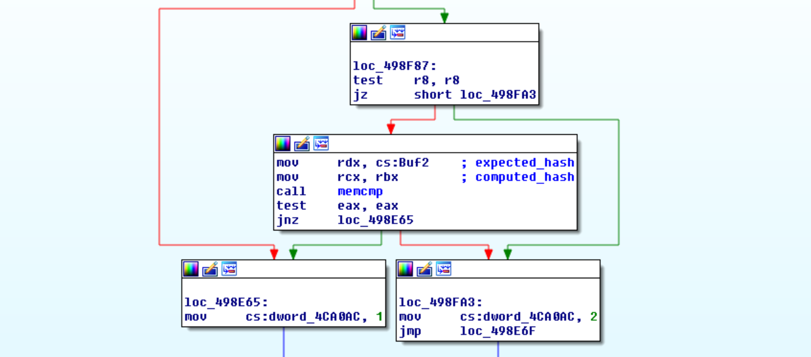
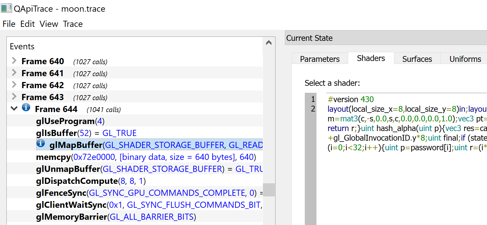

## Static analysis

On a first look, we determine it's a Win32 executable, rendering a simple UI with OpenGL. Once opened, it asks for a password of length 32. For wrong passwords it will reply with the message: "*Nope*".

As usual with these kind of challenges, one would start by looking for occurrences of this string within the executable, and find code referencing that string. Opening the executable with IDA Pro and searching for strings containing `Nope` we find the string `____NopeGood` referenced in `sub_402660`. Decompiled and slightly formatting the relevant code results in:

```cpp
  v12 = dword_4CA0AC;
  v15 = 4 * v12;
  v16 = (unsigned __int8)aNopegood[v15];
```

The value `dword_4CA0AC` acts as an index into the aforementioned string. If we want to succeed (i.e. obtain `Good`) we need its value to be 2. If we search of occurrences where the value at `4CA0AC` is modified to 2 we obtain the following occurrence in the function `sub_498A10`:



In order to pass the test, both buffers passed to `memcmp` have to match.


## Dynamic analysis

To simplify the process of reversing a bit, we used [x64dbg](http://x64dbg.com/) to easily debug and inspect the memory of the program while it's running.

These buffers seem to contain bytes corresponding to hexadecimal characters of what looks like a hash. Furthermore, the contents pointed by `rcx` changes as the password is modified while the contents pointed by `rdx` are constant (*expected buffer*). With every diffent password entered in the application, the buffer pointed by `rcx` is updated (*computed buffer*).

After reversing `sub_498A10`, we realize that the *computed buffer* is generated by printing each integer from a buffer of type `uint32_t[64]` (i.e. length 0x100) into an hexadecimal string via `%.8x` (see `sub_4016D0`). Concatenating all these hexadecimal strings results in the aforementioned value.

```cpp
v14 = (__int128 *)&v41;
// ...
if ((unsigned __int8)sub_401BF0(qword_4CA080, (unsigned __int64)&v41)) {
  do {
    v15 = *(_DWORD *)v14;
    v28 = 0i64;
    v29 = 0;
    sub_4016D0(&v28, "%.8x", v15);
    v16 = (char *)&v28 + strlen((const char *)&v28);
    if ( v16 - (char *)&v28 > 0x7FFFFFFFFFFFFFFFi64 - Size )
      sub_4921C0("basic_string::append");
    sub_486EE0(&Memory, &v28, v16 - (char *)&v28);
    v14 = (__int128 *)((char *)v14 + 4);
  }
  // ...
}
```

Now, we investigated the origin of this `uint32_t[64]` buffer (pointer by `v41`). We noticed it is computed inside the function `sub_401BF0`.

Brief pause:
> As you see, instead of reverse engineering entire functions, our approach could be described as doing inverse data-taining manually and reverse engineering only what is absolutely necessary.

Inside `sub_401BF0` we attempted to locate where was this data copied to `v41` coming from. Once we found the buffer, we noticed quite a strange behaviour, hardware breakpoints on memory accesses were not working (*red flag #1*). Then we noticed that this buffer was instantly filled, after calling functions from my GPU driver libraries (*red flag #2*). We suspect the computations of the hash are being done on the GPU.


## Extracting compute shaders

Looking at the executable strings, it's clear that no compute shader is visible as plaintext. However, rather than inspecting of the many functions is responsible of decrypting the GLSL source, or trying to locate it somewhere within the user address space. We fetch it from where *moon.exe* cannot hide it: the userland GPU drivers.

For that purpose we use [Apitrace](http://apitrace.github.io/). We spawn *moon.exe* with it in *GL* mode, fill out a dummy password and inspect the list of frames. From a long list of frames, each with 1027 calls, we notice one with 1041 calls. As expected, the small difference here is that the application maps a shader storage buffer:



After prettying the GLSL code we obtain the following [moon.glsl](moon.glsl). The source code speaks for itself and explains the meaning behind the buffers in `sub_401BF0`.

```glsl
layout(std430, binding = 0) buffer shaderExchangeProtocol {
  uint state[64];
  uint hash[64];
  uint password[32];
};
```

Every invocation of the compute shader results in a `uint32_t` value being updated in the `hash` buffer. At the same offset in `state`, another value changes f rom 1 to 2 to mark the task as finished.

For every character in `password`, two different hashes are computed, `hash_alpha` and `hash_beta`, each resulting in a `uint32_t` value that is stored in the `hash` buffer after XOR'ing it further.

Our goal now is to recover the password from the expected hash. Here we noticed two possible approaches, a quick one (which we used in the CTF), and a more elegant one.


## Hacker's approach

Every invocation of the compute shader takes into account a single character of the password in order to generate a `uint32_t` value of the hash, except for the following final part that interates over the whole password:

```glsl
  uint h = 0x5a;
  for (i = 0; i < 32; i++) {
    uint p = password[i];
    uint r = (i * 3) & 7;
    p = (p << r) | (p >> (8 - r));
    p &= 0xff;
    h ^= p;
  }
  final ^= (h | (h << 8) | (h << 16) | (h << 24));
```

However, since `p` is always masked with 0xFF, `h` will be in range [0x00, 0xFF]. Thus, there are only 256 possible values with which the `final` variable could be XOR'ed (e.g. `01010101`, `02020202`, etc.). This can be bruteforced by iterating over every possible value of `h`.

* __Clever bruteforcer__: For every position `i` in the password, we try character `c` and temporarily set `password[i] = c`. We calculate the first of the two resulting `uint32_t` hash values (we don't need the second one!) and, as described before, we XOR the result with every of the 256 possible values with which `final` could be XOR'ed. If there's a match, we keep the character `c` and move on with the next `i`.

Considering a 32-byte password and 256 choices for each `c` and `h`, we get the following worst case scenario: 32 * 256 * 256 = 2097152 attempts.

We could reimplement the whole algorithm, which would certainly save computing time. But on a CTF, it's *our* time the one that matters. To solve the challenge as quick as possible time we used [Frida](https://www.frida.re/) to instrument *moon.exe*, and automatically execute the function `sub_401BF0` for arbitrary passwords. You can find the source code at [bruteforcer.py](bruteforcer.py).


To explain the code briefly: We allocate the buffers that will hold both the password and hash. We will pass them as arguments to the *keygen* function (aka. `sub_401BF0`), which is transformed into a `NativeFunction` to be invocated later directly from our code.

```javascript
// Buffers 
var pswd_ptr = Memory.alloc(0x20);
var hash_ptr = Memory.alloc(0x400);

var keygen_ptr = new NativePointer(0x401BF0);
var keygen = new NativeFunction(keygen_ptr, 'int', ['pointer', 'pointer']);
```

Then, for every choice of `i`, `c`, `h`, we have the following block of code, deep within the nested main loops.

```javascript
var maskh = mask(h | (h << 8) | (h << 16) | (h << 24));
Memory.writeU8(pswd_ptr.add(i), c);
keygen(pswd_ptr, hash_ptr);
var dword = Memory.readU32(hash_ptr.add(8*i)) ^ maskh;
if (mask(dword) == mask(expected[2*i])) {
  valid = true;
  break;
}
```

After 1 minute of computeing time we obtain the following output:

```
           0  1  2  3  4  5  6  7  8  9  A  B  C  D  E  F  0123456789ABCDEF
00000000  43 54 46 7b 4f 70 65 6e 47 4c 4d 6f 6f 6e 4d 6f  CTF{OpenGLMoonMo
00000010  6f 6e 47 30 65 73 54 30 54 68 65 4d 6f 6f 6e 7d  onG0esT0TheMoon}
```

Thus, we obtain the flag: `CTF{OpenGLMoonMoonG0esT0TheMoon}`.


## Mathematician's approach

(Soon...)